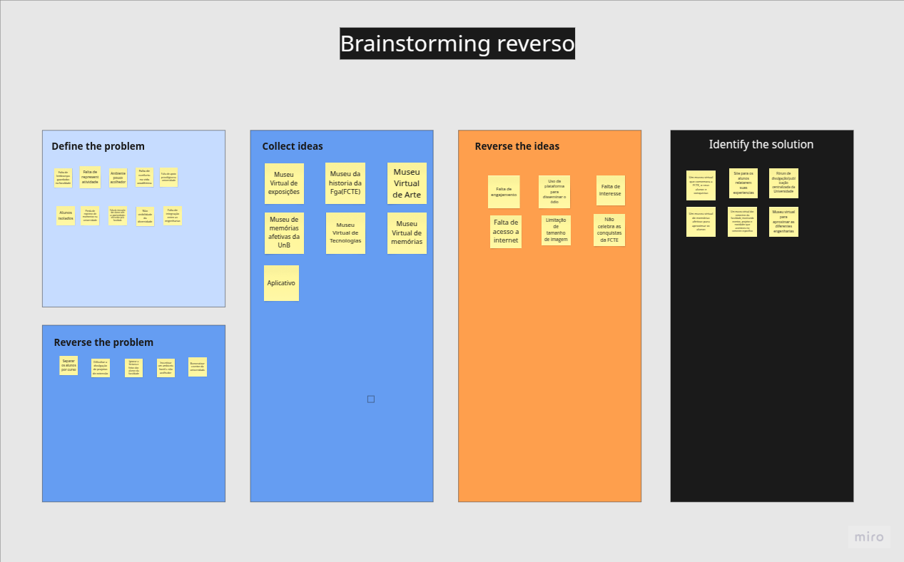

## Etapa: Map

A etapa **Map** do Design Sprint corresponde ao momento inicial de investigação e alinhamento entre os membros da equipe. O objetivo principal desta fase é construir uma compreensão compartilhada sobre o problema a ser resolvido, considerando as perspectivas dos usuários, os objetivos organizacionais e as restrições técnicas envolvidas. De acordo com Knapp et al. (2016), essa etapa visa “descompactar” todo o conhecimento existente sobre o desafio antes de avançar para ideação de soluções.

Neste projeto, foram utilizados três artefatos complementares: **Mapa Mental**, **Brainstorm Reverso** e o quadro **"Que Público é Esse?"**. Cada um deles foi escolhido por sua capacidade de ampliar a análise do problema e refinar o entendimento sobre o público-alvo.

---

### Mapa Mental

O **Mapa Mental** foi utilizado como ferramenta para estruturar e organizar o conhecimento relacionado ao problema central. Segundo Buzan (2006), mapas mentais são representações gráficas que facilitam a organização de ideias de forma hierárquica e associativa, promovendo a criatividade. A utilização dessa ferramenta permitiu à equipe visualizar conexões entre temas, identificar problemas e a decisão de trazer o museu virtual para o contexto de memórias afetivas. Essa estrutura serviu como base para as atividades subsequentes.

O projeto [MUMA - Museu Multimídia de Arte](https://muma.art.br/) nos inspirou a adaptar o conceito de museu ao nosso contexto acadêmico.

### Brainstorm Reverso

O **Brainstorm Reverso** foi aplicado como técnica de identificação de riscos e obstáculos a partir da inversão do problema. Em vez de pensar diretamente em soluções, os participantes foram convidados a refletir sobre formas de **agravar** a situação. Essa abordagem segue os princípios do pensamento lateral descritos por De Bono (1993), que propõe a provocação deliberada como mecanismo para ampliar possibilidades.

> *"Instead of looking for the right answer, lateral thinking encourages looking for different perspectives, even if initially illogical."* (DE BONO, 1993)

---

### "Que Público é Esse?"

A atividade **"Que Público é Esse?"** foi inspirada em metodologias de design centrado no usuário, especialmente o **Mapa de Empatia** (Gray et al., 2010) e o **Persona Canvas** (Pruitt & Adlin, 2006). O objetivo desta dinâmica foi caracterizar os perfis dos usuários-alvo. Esse mapeamento foi essencial para garantir que as decisões futuras do projeto considerassem as reais demandas dos usuários.

> *"Personas help teams to focus on specific users, and thereby support decision-making around design requirements."* (PRUITT & ADLIN, 2006)

---

### Considerações Finais

A integração dessas três ferramentas resultou em uma compreensão bem fundamentada do problema, a decisão por usar essas trẽs ferramentas foi algo que nos enturmou, pois cada um trouxe suas ideias. O processo colaborativo e investigativo realizado na fase **Map** viabilizou uma definição mais precisa do escopo de atuação e potencializou a qualidade das soluções ideadas nas etapas seguintes.

---

### Referências

- DE BONO, Edward. *Serious Creativity: Using the Power of Lateral Thinking to Create New Ideas*. New York: HarperBusiness, 1993.  
- GRAY, Dave; BROWN, Sunni; MACANUFO, James. *Gamestorming: A Playbook for Innovators, Rulebreakers, and Changemakers*. O'Reilly Media, 2010.  
- KNAPP, Jake; ZERATSKY, John; KOWITZ, Braden. *Sprint: How to Solve Big Problems and Test New Ideas in Just Five Days*. New York: Simon & Schuster, 2016.  
- PRUITT, John; ADLIN, Tamara. *The Persona Lifecycle: Keeping People in Mind Throughout Product Design*. Morgan Kaufmann, 2006.
- SERRANO, Milene. *VideoAula - DSW-Base - Mapa Mental*. Acesso em: 06 abr. 2025.

---