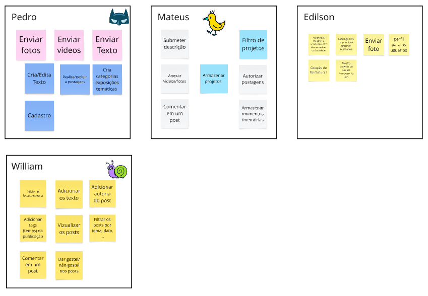

# Artefato Decision

Esse artefato foi feito a partir de uma reunião online onde todos os membros do grupo se juntaram em uma chamada de áudio para discutir e organizar as funcionalidades que gostaríamos de ver em um sistema de museu digital da UnB -FCTE. A ideia era compartilhar nossas opiniões e pensar, juntos, nas principais funções que o sistema deveria ter, usando um quadro digital no MIRO para registrar as ideias de forma visual e interativa.

## Sobre o Processo

O processo foi estruturado e colaborativo, utilizando ferramentas como Miro e Discord para facilitar a troca de ideias e a organização das funcionalidades. Cada membro contribuiu com sugestões baseadas em suas experiências e nas necessidades do projeto, registradas com post-its digitais no Miro

## Quadros Individuais

Na Figura 1, podemos ver a colaboração individual de cada um dos membros do grupo. Cada quadro representa as ideias e sugestões de um participante, organizadas de maneira visual para facilitar a análise e discussão durante a reunião. Esse formato ajudou a visualizar rapidamente as diferentes abordagens para as funcionalidades do sistema.

  
<strong>Figura 1:</strong> quadro individual

  
<strong>Autores:</strong> Todos os integrantes

## Quadro Geral
Após a organização inicial das ideias nos quadros individuais de cada membro, realizamos uma votação para priorizar as funcionalidades mais importantes a serem incorporadas no sistema. Cada integrante teve direito a três votos, que foram usados para eleger as funcionalidades que consideravam mais relevantes. Essa abordagem ajudou a filtrar e agrupar as ideias semelhantes, permitindo que definíssemos com mais clareza quais funcionalidades mereciam maior atenção no desenvolvimento do sistema. O quadro geral, mostrado na **Figura 2** abaixo, reflete esse processo de organização e as decisões tomadas em conjunto.

  
<strong>Figura 2:</strong> quadro geral

  

  
<strong>Autores:</strong> Todos os integrantes

## Fluxos 
A partir do quadro geral na **Figura 2**, planejamos os fluxos principais que consideramos essenciais dentro do aplicativo para garantir uma boa experiência ao usuário. Os tópicos principais, destacados em vermelho, representam as funcionalidades centrais que guiarão a interação do usuário com o sistema. Esses tópicos são:

    FILTRAR MEMÓRIAS: Permite ao usuário aplicar filtros para visualizar memórias específicas.

    COMPARTILHAR MEMÓRIAS: Facilita o compartilhamento de memórias com outros usuários.

    VER MEMÓRIAS: Exibe as memórias de forma organizada, com a possibilidade de visualizar detalhes.

    ENVIAR MÍDIAS: Funcionalidade para enviar e compartilhar fotos, vídeos e outros tipos de mídia.

    MODERAÇÃO DE POSTAGENS: Permite a moderação de postagens para garantir o conteúdo adequado no sistema.

    ACESSIBILIDADE: Implementação de recursos como VLibras, texto alternativo, aumento de fonte e regras WCAG para tornar o sistema mais acessível.

Abaixo na **Figura 3** podemos ver como ficaram organizados as ideias e os fluxos idealizados durante a reunião.

  
<strong>Figura 3:</strong> Fluxos do aplicativo

  
<strong>Autores:</strong> Todos os integrantes

## Histórico de Versão
| Versão | Data | Descrição | Autor(es) | Data de revisão | Revisor(es) |
| :-: | :-: | :-: | :-: | :-: | :-: |
| `1.0` | 10/04/2025  | Criação do documento | Gabriel| 10/04/2025 | Manuella |
| `2.0` | 10/04/2025  | Adição das imagens | Gabriel| 10/04/2025 | Manuella |
| `3.0` | 10/04/2025  | Reestruturação da página e criação da introdução | Gabriel| 10/04/2025 | William |
| `4.0` | 10/04/2025  | Adição de todos os elementos textuais| Gabriel| 10/04/2025 | Marcos |

