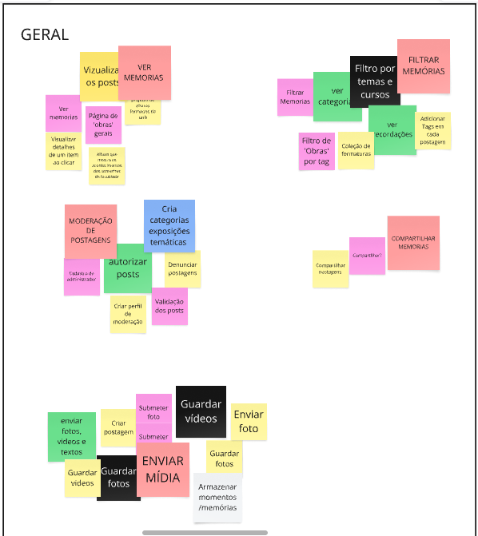

# Artefato Decision

Esse artefato foi feito a partir de uma reunião online onde todos os membros do grupo se juntaram em uma chamada de áudio para discutir e organizar as funcionalidades que gostaríamos de ver em um sistema de museu digital da UnB -FCTE. A ideia era compartilhar nossas opiniões e pensar, juntos, nas principais funções que o sistema deveria ter, usando um quadro digital no MIRO para registrar as ideias de forma visual e interativa.

# Sobre o Processo

O processo foi bem colaborativo e descontraído. Cada um trouxe suas sugestões com base nas experiências e necessidades que acreditávamos serem importantes para o projeto. Usamos post-its digitais para anotar as ideias, que foram então agrupadas por temas para facilitar a visualização. Algumas pessoas sugeriram funções mais relacionadas ao envio de fotos, vídeos e textos, enquanto outras focaram em como organizar e gerenciar o conteúdo dentro do sistema.

Ficou claro, ao longo da reunião, que o objetivo era reunir o maior número de ideias possíveis, com liberdade para explorar todos os aspectos do sistema. A ferramenta online permitiu que todos participassem igualmente, mesmo à distância, e nos ajudou a organizar as ideias de uma forma prática e objetiva. Na **figura 1** podemos ver a colaboração individual de cada um dos membros do grupo.

  
<strong>Figura 1:</strong> quadro individual

  
<strong>Autores:</strong> Todos os integrantes

  
<strong>Figura 2:</strong> quadro geral

  

  
<strong>Autores:</strong> Todos os integrantes

  
<strong>Figura 3:</strong> Fluxos do aplicativo

  
<strong>Autores:</strong> Todos os integrantes

## Histórico de Versão
| Versão | Data | Descrição | Autor(es) | Data de revisão | Revisor(es) |
| :-: | :-: | :-: | :-: | :-: | :-: |
| `1.0` | 10/04/2025  | Criação do documento | Gabriel| 10/04/2025 | Manuella |
| `2.0` | 10/04/2025  | Adição das imagens | Gabriel| 10/04/2025 | Manuella |
| `3.0` | 10/04/2025  | Reestruturação da página e criação da introdução | Gabriel| 10/04/2025 | William |

