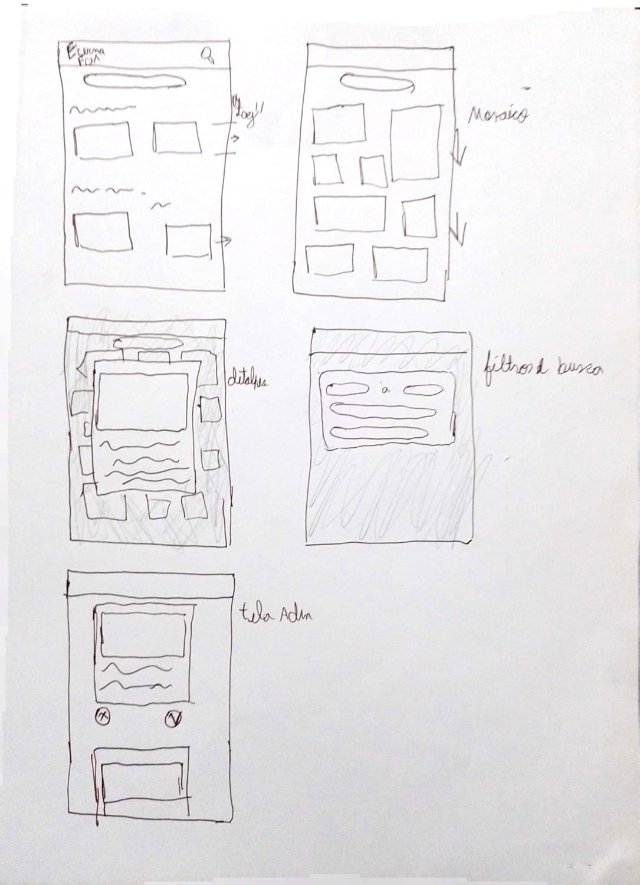
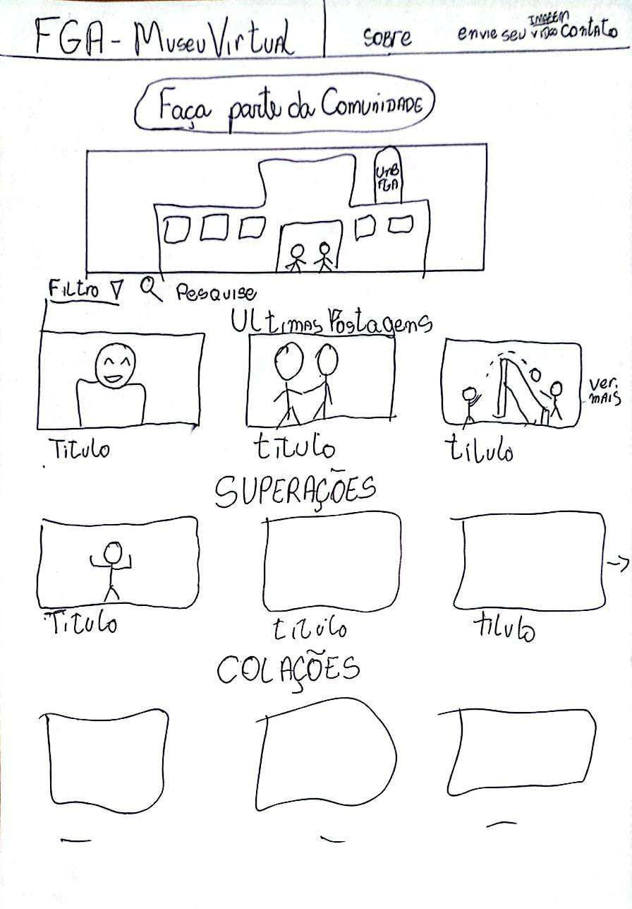
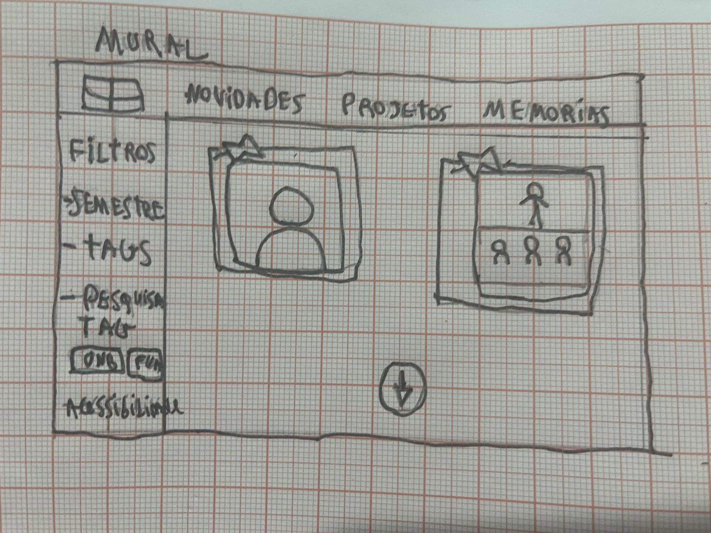
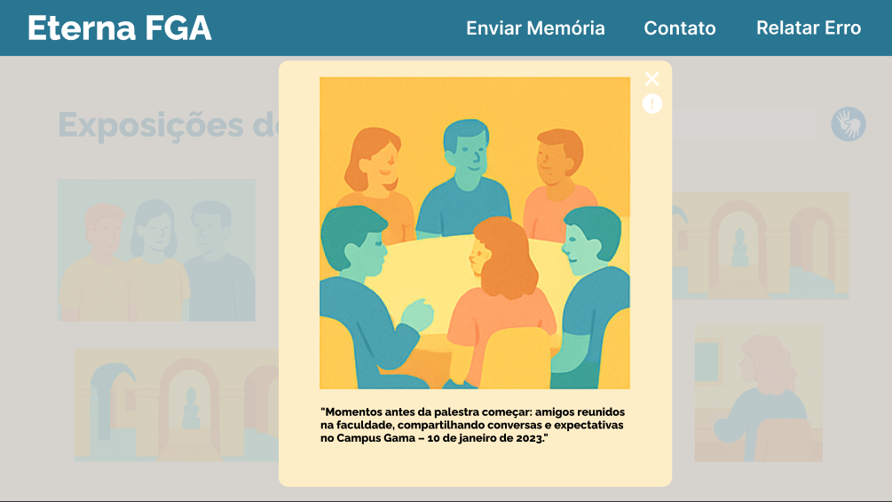

## Prototype

No artigo _System Development Method with the Prototype Method_, de Susanto e Meiryani (2019), é criado um protótipo que proporciona aos desenvolvedores e aos usuários uma compreensão equânime dos processos básicos do sistema.

De acordo o Design Sprint kit do Google, para realizar essa etapa protótipo, a equipe deve desenvolver o design do protótipo utilizando os elementos definidos na fase de Sketch, a fim de criar uma solução capaz de gerar feedback real para a fase de validação.

Em nosso projeto, utilizamos a técnica Crazy Eight. Nessa abordagem, os participantes têm 8 minutos para realizar um brainstorming de ideias de forma individual. Cada membro elaborou protótipos de baixa fidelidade, incorporando as principais ideias da plataforma. Ao final da atividade, as melhores sugestões foram discutidas e novos protótipos foram desenvolvidos a partir da combinação das propostas iniciais.

Protótipos de baixa fidelidade

Protótipos de baixa fidelidade (Fonte: Marcus Vinícius Figuerêdo Escobar)

Protótipos de baixa fidelidade (Fonte: Manuella Magalhães Valadares)

Protótipos de baixa fidelidade (Fonte: Marcos Vieira Marinho)

Protótipos de baixa fidelidade (Fonte: Cairo Florenço Santos)

Protótipos de baixa fidelidade (Fonte: William Bernardo da Silva)

Protótipos de baixa fidelidade (Fonte: Gustavo Feitosa Haubert)

Protótipos de baixa fidelidade (Fonte: Edilson Ribeiro da Cruz Júnior)

Protótipos consolidados

Protipo de alta fidelidade

 

### Considerações Finais

---

Em resumo, a integração da prototipagem com metodologias ágeis, como o Design Sprint e a técnica Crazy Eight, demonstra ser eficaz para alinhar as expectativas de desenvolvedores e usuários. Essa abordagem iterativa e colaborativa gera feedback real e contribui para o aprimoramento contínuo do produto final, garantindo que as soluções propostas atendam de forma prática e inovadora às necessidades identificadas.

---

### Referências

---

SUSANTO, A.; MEIRYANI. _System Development Method with the Prototype Method. International Journal of Scientific & Technology Research_, v. 8, p. 141-144, 2019. Disponível em: https://api.semanticscholar.org/CorpusID:199656589. Acesso em: 9 de Abril de 2025.

GOOGLE. _Design Sprint Kit – Phase 5: Prototype_. Disponível em: https://designsprintkit.withgoogle.com/methodology/phase5-prototype. Acesso em: 09 abr. 2025.

---
