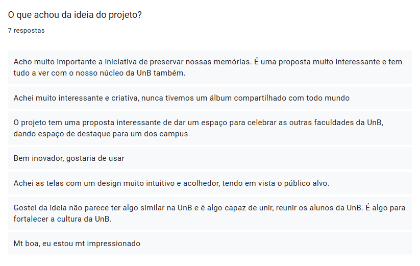
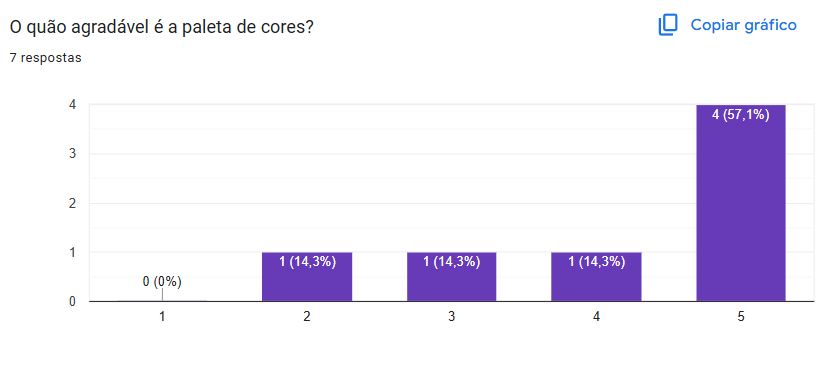

# Etapa: Teste

A etapa de teste é a última fase do Design Sprint. O principal objetivo é validar a solução prototipada com potenciais usuários, para entender se ela realmente resolve o problema proposto. É nesta fase do Design Sprint que a equipe decide se continuará com o projeto ou irá abandoná-lo. Nesse caso, utilizamos o Google Forms para realizar o teste de validação. 

Protótipo utilizado no Teste de Validação

(Fonte: [Cairo](https://github.com/CA1RO), [Gustavo Haubert](https://github.com/GustavoHaubert))

## Resultados 

Resultados da pergunta 1 (Fonte: [Cairo](https://github.com/CA1RO), [Gustavo Haubert](https://github.com/GustavoHaubert))

Resultados da pergunta 2 (Fonte: [Cairo](https://github.com/CA1RO), [Gustavo Haubert](https://github.com/GustavoHaubert))

Resultados da pergunta 3 (Fonte: [Cairo](https://github.com/CA1RO), [Gustavo Haubert](https://github.com/GustavoHaubert))

 

Resultados da pergunta 4 (Fonte: [Cairo](https://github.com/CA1RO), [Gustavo Haubert](https://github.com/GustavoHaubert))

## Conclusão 

Recebemos retornos positivos tanto sobre a ideia do Eterna FGA quanto sobre o protótipo desenvolvido. As respostas indicaram que o propósito do projeto foi bem compreendido e demonstrou ser uma iniciativa relevante para a comunidade acadêmica. Além disso, mesmo sendo uma primeira versão, o protótipo apresentou bons resultados, mostrando-se intuitivo para os usuários. Ademais, as respostas mostraram que a paleta de cores do projeto precisa não agradou a todos e será repensada em versões futuras.

## Histórico de Versão
| Versão | Data | Descrição | Autor(es) | Data de revisão | Revisor(es) |
| :-: | :-: | :-: | :-: | :-: | :-: |
| `1.0` | 10/04/2025  | Criação do Testes de Validação. | Cairo | 10/04/2025 | Gustavo |
| `1.1` | 10/04/2025  | Adição da conclusão dos Testes. | Cairo | 10/04/2025 | Gustavo |

