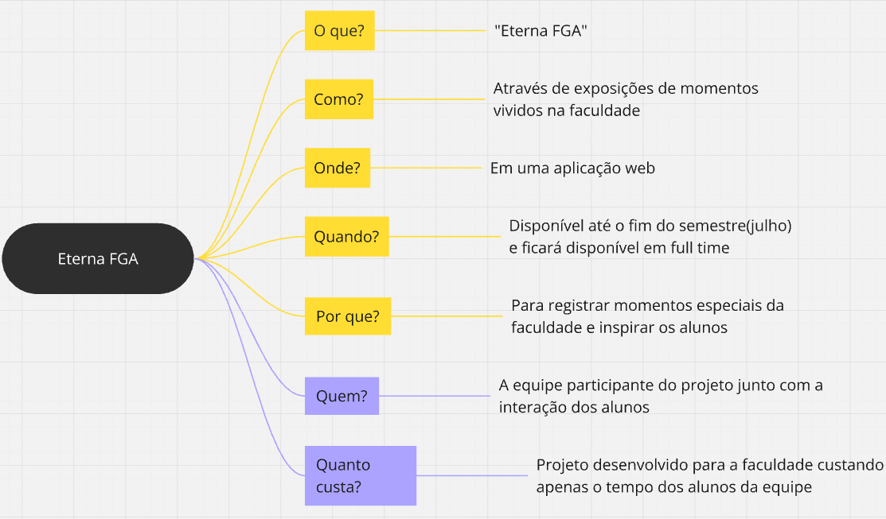

# 5W2H #

# Introdução #

A metodologia 5W2H é uma ferramenta de gestão amplamente utilizada para planejamento, organização e execução de ações em diversos contextos, desde projetos empresariais até a resolução de problemas cotidianos. Seu nome deriva das iniciais de sete perguntas fundamentais, originadas do inglês: What (O que?), Why (Por quê?), Where (Onde?), When (Quando?), Who (Quem?), How (Como?) e How much (Quanto custa?). Ao responder de forma objetiva e estruturada a essas perguntas, é possível ter uma visão clara e prática de um plano de ação, facilitando a tomada de decisões, a comunicação entre equipes e o acompanhamento de resultados. Simples e eficiente, o 5W2H se destaca por sua aplicação versátil e pelo suporte que oferece à gestão estratégica e operacional.

# Quadro #

# Explicação #

## O que? ##
    Faremos uma Aplicação chamada "Eterna FGA".

## Como? ##
    Faremos uma aplicação que ira expor momentos vividos na faculdade como um museu virtual.

## Onde? ##
    Faremos uma aplicação web.

## Quando? ##
    Iremos entregar a aplicação até o fim do semestre em julho e ficará disponível 24 horas por dia durante os 7 dias da semana.

## Por que? ##
    Para registrar os momentos vividos na faculdade, sejam eles projetos acadêmicos ou momentos pessoais, assim inspirando outros alunos a conhecer mais sobre a faculdade e seus projetos e oportunidades.

## Quem? ##
    A equipe que participa do projeto junto com a participação dos alunos que irá nos enviar o material para a exposição.

## Quanto custa? ##
    O projeto será feito para a Disciplina de Arquitetura e Desenho de Software logo custara apenas o tempo que iremos dedicar para essa matéria.

## Histórico de Versão
| Versão | Data | Descrição | Autor(es) | Data de revisão | Revisor(es) |
| :-: | :-: | :-: | :-: | :-: | :-: |
| `1.0` | 10/04/2025  | Versão inicial do artefato. | Pedro | 10/04/2025 | Mateus |