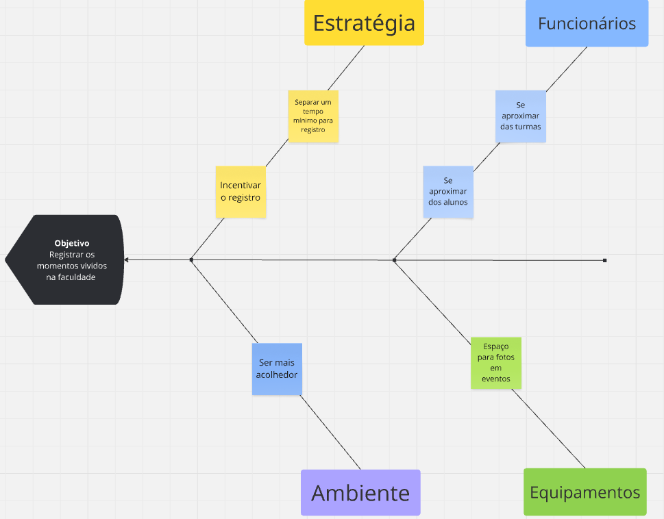

# Diagrama Causa e Efeito #

## Introdução ##
O Diagrama de Causa e Efeito, também conhecido como Diagrama de Ishikawa ou Diagrama Espinha de Peixe, é uma ferramenta de qualidade desenvolvida por Kaoru Ishikawa com o objetivo de identificar, organizar e representar graficamente as possíveis causas de um problema ou efeito específico. Muito utilizado em processos de análise e melhoria contínua, o diagrama permite que equipes visualizem de forma estruturada as relações entre um problema central e suas causas potenciais, agrupadas geralmente em categorias como método, mão de obra, máquina, material, meio ambiente e medição (os 6Ms). Essa abordagem facilita a identificação das raízes do problema, promovendo a análise crítica e a definição de ações corretivas mais eficazes.

## Quadro ##

## Histórico de Versão
| Versão | Data | Descrição | Autor(es) | Data de revisão | Revisor(es) |
| :-: | :-: | :-: | :-: | :-: | :-: |
| `1.0` | 10/04/2025  | Versão inicial do artefato. | Pedro | 10/04/2025 | Mateus |