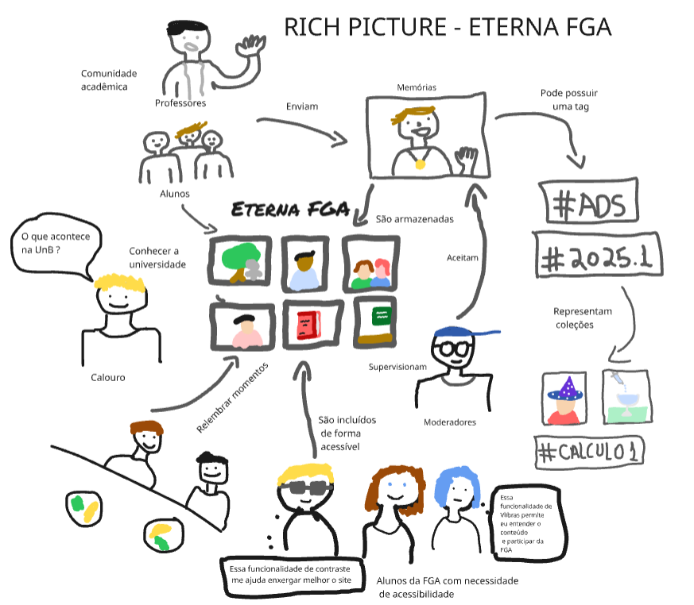

# Rich Picture #

## Introdução ##
O Rich Picture é uma ferramenta visual utilizada principalmente na área de análise de sistemas, resolução de problemas complexos e levantamento de requisitos. Seu principal objetivo é representar, de forma não técnica, todas as partes interessadas, ideias, problemas, emoções, relações e interações envolvidas em um determinado sistema ou situação.

## Rich Picture ##

---

## Rich Picture 2 ##

Rich Picture desenvolvido pelos integrantes Cairo e Gustavo apresentando uma nova visão sobre o projeto Eterna FGA. Nele há uma ilustração com foco em explicar os usuários do projeto e também a perspectiva e a interação do administrador com a Eterna FGA assim como a representação de funcionalidades como as tags das memórias. Além disso, o desenho apresenta uma visão sobre um possível uso do museu virtual de memórias afetivas para calouros interessados em conhecer a universidade. 

Rich Picture 2 (Fonte: [Cairo](https://github.com/CA1RO), [Gustavo Haubert](https://github.com/GustavoHaubert))

## Histórico de Versão
| Versão | Data | Descrição | Autor(es) | Data de revisão | Revisor(es) |
| :-: | :-: | :-: | :-: | :-: | :-: |
| `1.0` | 10/04/2025  | Versão inicial do artefato. | Pedro | 10/04/2025 | Mateus |
| `2.0` | 11/04/2025  | Adição de novo Rich Picture. | Cairo e Gustavo | 11/04/2025 | Pedro |
| `3.0` | 11/04/2025  | Adição da descrição do Rich Picture 2. | Cairo e Gustavo | 11/04/2025 | Pedro |

