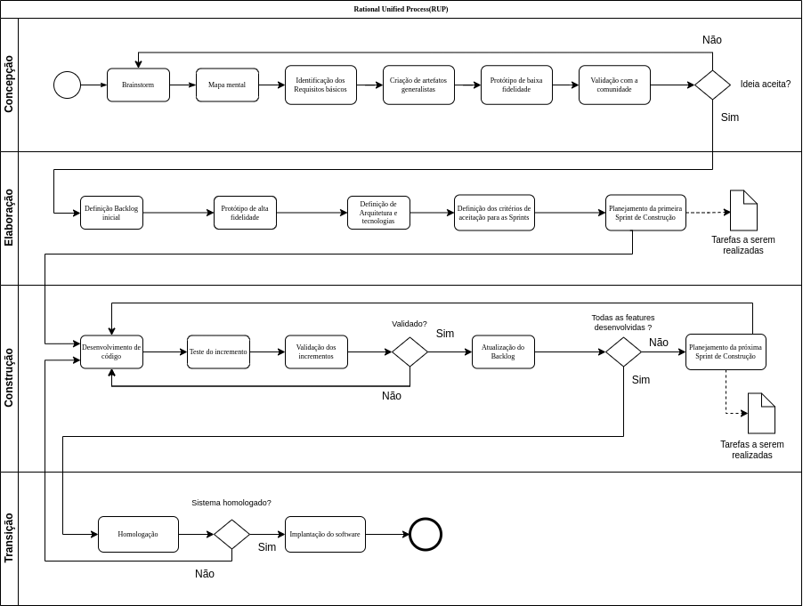
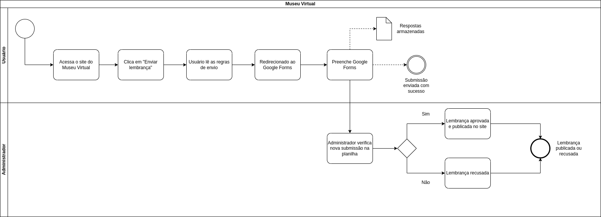
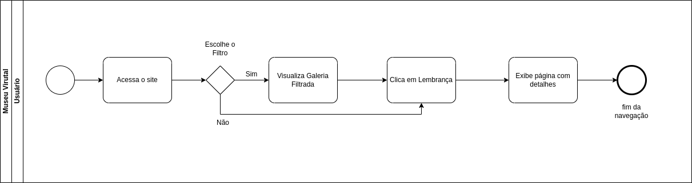
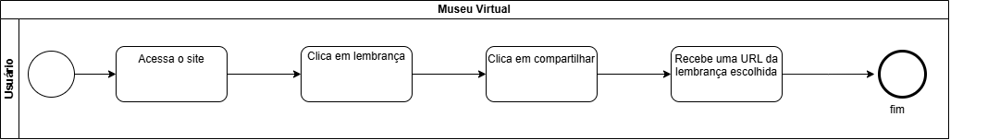
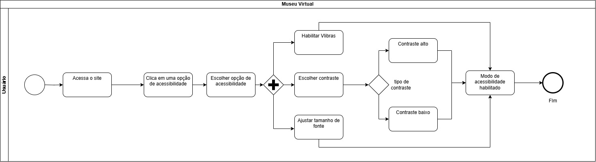

# Modelagem BPMN do Projeto Museu Virtual

## introdução

A Business Process Model and Notation (BPMN) é uma notação padronizada que permite representar graficamente processos de negócios. Sua utilização neste projeto visa facilitar a comunicação entre equipe técnica e partes interessadas, além de auxiliar na documentação e entendimento dos fluxos relacionados à experiência do usuário e à metodologia adotada.

## Modelagens BPMN Desenvolvidas

### 1. Modelagem Metodológica

Representa o processo de desenvolvimento seguindo a metodologia Rational Unified Process (RUP), com inspiração em práticas ágeis como Scrum e Extreme Programming (XP).

Figura 1 - BPMN de Metodologia (Fonte: [Gustavo Haubert](https://github.com/GustavoHaubert), [Marcos Vieira](https://github.com/devMarcosVM), [Marcus Escobar](https://github.com/MarcusEscobar))

---

### 2. Fluxo de Inserção de Lembrança pelo Usuário

Descreve o processo em que o usuário acessa o site, preenche um formulário via Google Forms, e a lembrança é avaliada por um administrador.

Figura 2 - BPMN de inserção de lembrança (Fonte: [Gustavo Haubert](https://github.com/GustavoHaubert), [Marcos Vieira](https://github.com/devMarcosVM), [Marcus Escobar](https://github.com/MarcusEscobar))

---

### 3. Fluxo de Navegação do Usuário no Museu

Ilustra a experiência de navegação do visitante, incluindo filtragem de memórias, visualização detalhada e possibilidade de compartilhamento.

Figura 3 - BPMN de navegação do usuário (Fonte: [Gustavo Haubert](https://github.com/GustavoHaubert), [Marcos Vieira](https://github.com/devMarcosVM), [Marcus Escobar](https://github.com/MarcusEscobar))

---

---

Figura 4 - BPMN fluxo de compartilhamento (Fonte: [Cairo](https://github.com/CA1RO), [Pedro](https://github.com/Goizzz))

---

Figura 5 - BPMN fluxo de Acessibilidade (Fonte: [Edilson](https://github.com/Edilson-r-jr), [Matheus](https://github.com/Mateushqms))

---

## Detalhamento Metodológico

A equipe adotou o **Rational Unified Process (RUP)** como base metodológica, com elementos das metodologias ágeis como **Scrum** e **XP (Extreme Programming)**. O processo foi estruturado da seguinte forma:

- **Concepção:** Definição do escopo do projeto, análise dos objetivos e entendimento dos usuários e funcionalidades básicas. Levantamos também as ferramentas de apoio ao desenvolvimento, como o Google Forms e planilhas integradas.

- **Elaboração:** Modelagem inicial das funcionalidades e organização das tarefas. Iniciamos a modelagem BPMN e realizamos a priorização de funcionalidades com base em impacto e viabilidade. Foram definidos critérios de aceitação e feita a alocação inicial das responsabilidades da equipe.

- **Construção:** Implementações de protótipos e elaboração dos fluxos em BPMN. Utilizamos práticas ágeis como:

  - **Sprints curtas e iterativas** para avanço contínuo;
  - **Revisões constantes** dos diagramas e funcionalidades;
  - **Refatorações rápidas** conforme feedback dos colegas;

- **Transição:** Preparamos a entrega final com os fluxos modelados, documentação estruturada, versão publicada na Wiki e plano de testes para homologação das etapas. Também foi prevista a coleta de feedback do usuário para melhorias futuras.

## Justificativas e Senso Crítico

- Adoção do RUP pela necessidade de manter uma organização estruturada nas etapas do projeto.
- Incorporação de práticas ágeis visando flexibilidade, adaptabilidade e feedback contínuo.
- Escolha do Google Forms e integração com planilhas como uma solução viável, de baixo custo e de fácil acesso para a comunidade acadêmica.
- O BPMN foi essencial para tornar visíveis os processos tanto metodológicos quanto da experiência do usuário final.

---

### Referências

- SERRANO, Milene. _VideoAula - DSW-BPMN_. Acesso em: 08 abr. 2025.
- Object Management Group (OMG). _Business Process Model and Notation (BPMN)_ Version 2.0. 2011. Disponível em: https://www.omg.org/spec/BPMN/2.0. Acesso em: 11 abr. 2025.

## Histórico de Versão

| Versão |    Data    |                           Descrição                            |     Autor(es)     | Data de revisão | Revisor(es) |
| :----: | :--------: | :------------------------------------------------------------: | :---------------: | :-------------: | :---------: |
|  1.0   | 08/04/2025 |                  Versão inicial do artefato.                   |      Marcos       |   10/04/2025    |  Manuella   |
|  1.1   | 10/04/2025 |                 Adicionando fonte às imagens.                  |      Gustavo      |   10/04/2025    |    Cairo    |
|  1.2   | 10/04/2025 |   Adicionando BPMN do fluxo de compartilhamento de memórias.   |   Cairo e Pedro   |   10/04/2025    |   Marcos    |
|  1.3   | 11/04/2025 |           Criação da introdução e revisão de siglas            | Gabriel e William |   11/04/2025    |  Manuella   |
|  1.4   | 11/04/2025 | Revisão da metodologia, adicionando referencias significativas |     Manuella      |   11/04/2025    |   Marcus    |
|  1.5   | 11/04/2025 |                Adiciona BPMN de acessibilidade                 | Edilson e Matheus |   11/04/2025    |    Cairo    |
