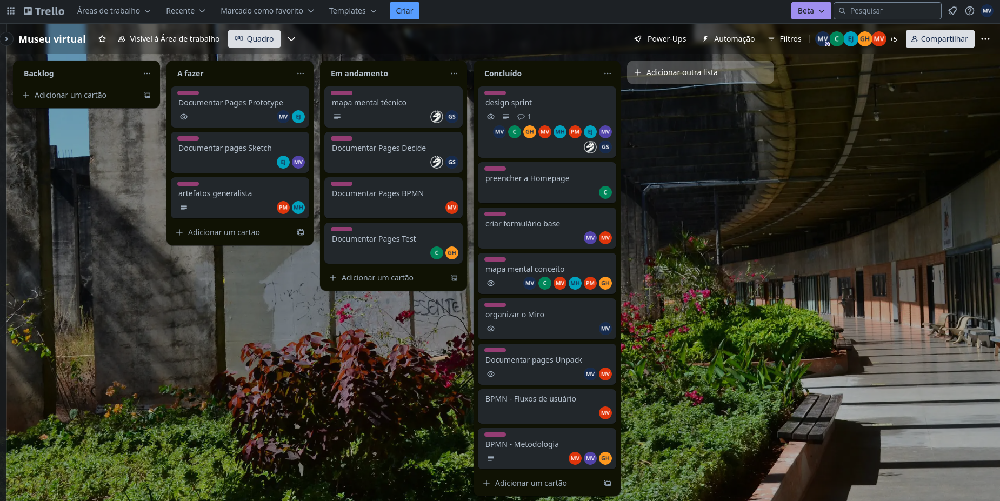
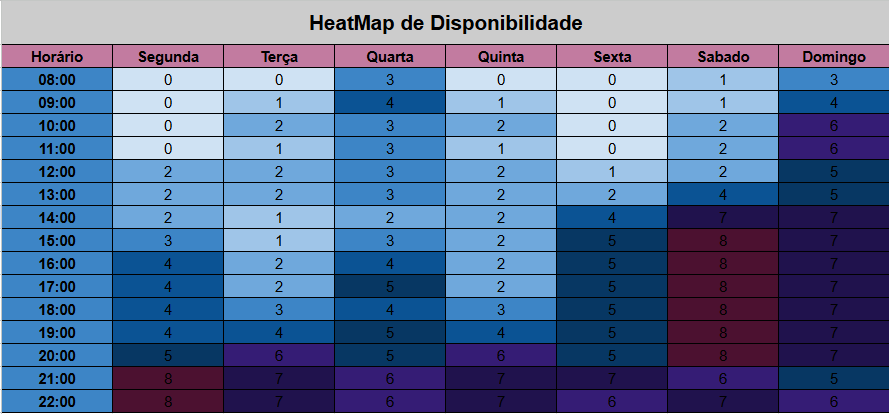
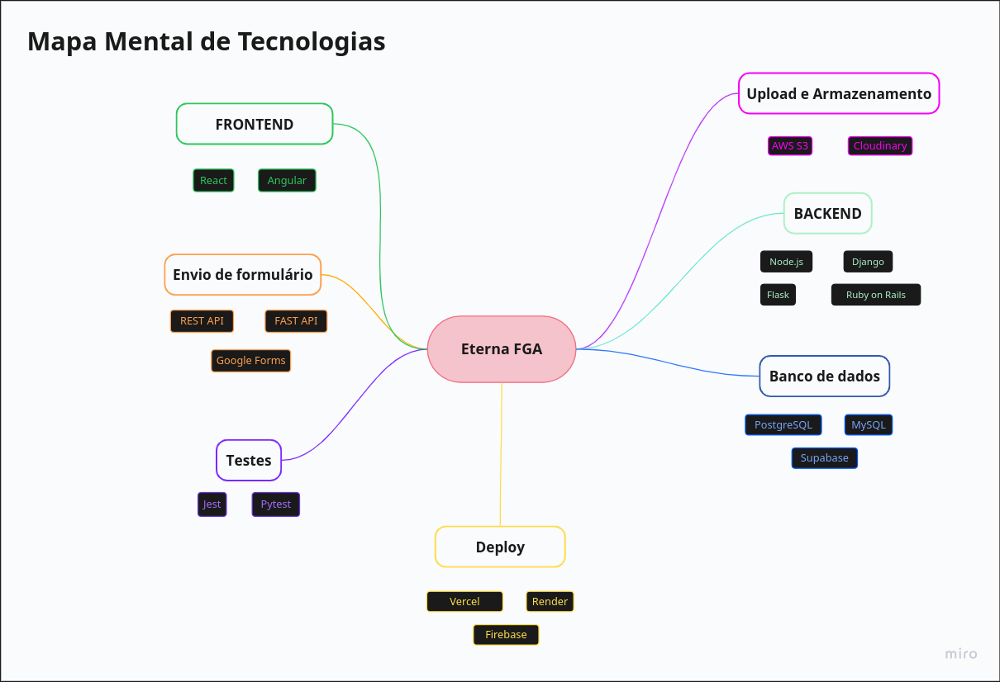
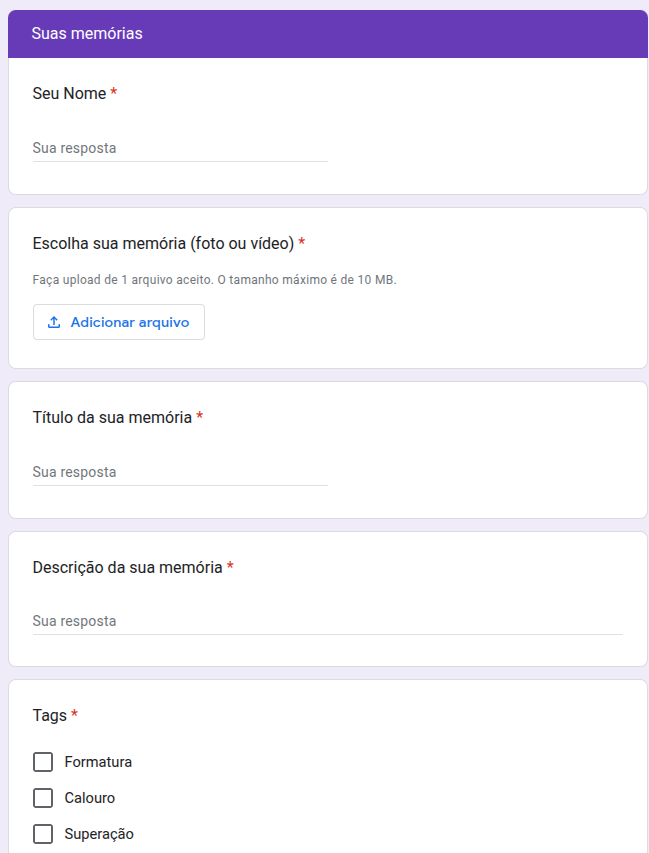

# 1.5. Iniciativas Extras (Base)

## Criação de Quadro Kanban Adaptado

Como iniciativa complementar ao desenvolvimento do projeto, criamos de um quadro Kanban adaptado para a equipe. O objetivo foi organizar melhor as tarefas, promover mais clareza sobre o andamento das etapas e facilitar o acompanhamento das entregas por todos os integrantes do grupo. 

O quadro foi estruturado considerando a primeira entrega, mas iremos continuar o uso desse artefato para contribuir para uma gestão mais eficiente e colaborativa das atividades.

#### Uso do&nbsp;<a href="https://trello.com/invite/b/67f1ac08b0dd0ab69880858a/ATTIa9c478e20ac9cbdf99e76dbc80db192776E11088/museu-virtual">quadro</a> durante a primeira entrega:

## Heatmap de Disponibilidade da Equipe

Cada integrante do grupo preencheu uma tabela de disponibilidade, como resultado obtivemos um heatmap para descobrir os horários em que a maioria dos integrantes da equipe estivessem disponíveis para discutir sobre o projeto.

## Mapa Mental de Tecnologias

Com o objetivo de organizar, visualizar e facilitar a tomada de decisões sobre as ferramentas e soluções técnicas que podem ser utilizadas em cada etapa do sistema, foi criado um **Mapa Mental de Tecnologias** pensado para cada área que o projeto irá abranger.

## Formulário Para Criar uma Postagem no Site

Como parte das iniciativas extras, foi desenvolvido um formulário para facilitar a criação de postagens no site do projeto. Este formulário tem como objetivo padronizar as informações coletadas, agilizar o processo de publicação e garantir que todos os dados necessários sejam preenchidos de forma clara e objetiva.

Esse formulário também é essencial para que a comunidade possa enviar os conteúdos que desejam inserir no site. As respostas enviadas por meio do formulário são direcionadas ao administrador, que será responsável por aceitar ou recusar as postagens submetidas.

[Formulário para Criação de Postagem](https://docs.google.com/forms/d/e/1FAIpQLSddyLQ9LEoxvl8xMnpVwEMawxbV9Nhg4-V_8amNUZ72tB6Cfg/viewform?usp=header)

### Visualização do Formulário:

#### Exemplo de Perguntas:

## Histórico de Versão
| Versão | Data | Descrição | Autor(es) | Data de revisão | Revisor(es) |
| :-: | :-: | :-: | :-: | :-: | :-: |
| `1.0` | 10/04/2025  | Inclusão do quadro Kanban. | Manuella | 10/04/2025 | Gabriel |
| `2.0` | 10/04/2025  | Inclusão do Mapa mental de tecnologias. | Will e Gabriel| 10/04/2025 | Manuella |
| `3.0` | 10/04/2025  | Inclusão do formulário de postagem | Marcos e Marcus| 10/04/2025 | Edilson |
| `4.0` | 11/04/2025  | Inclusão da imagem do heatmap | Cairo | 11/04/2025 | Manuella |

